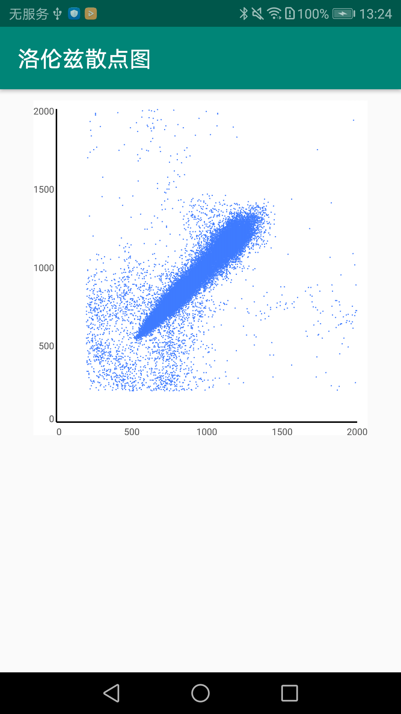
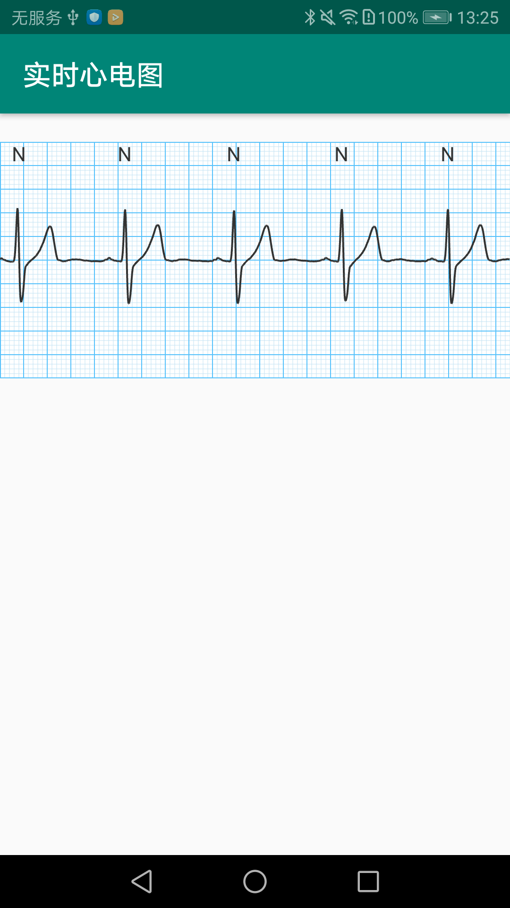
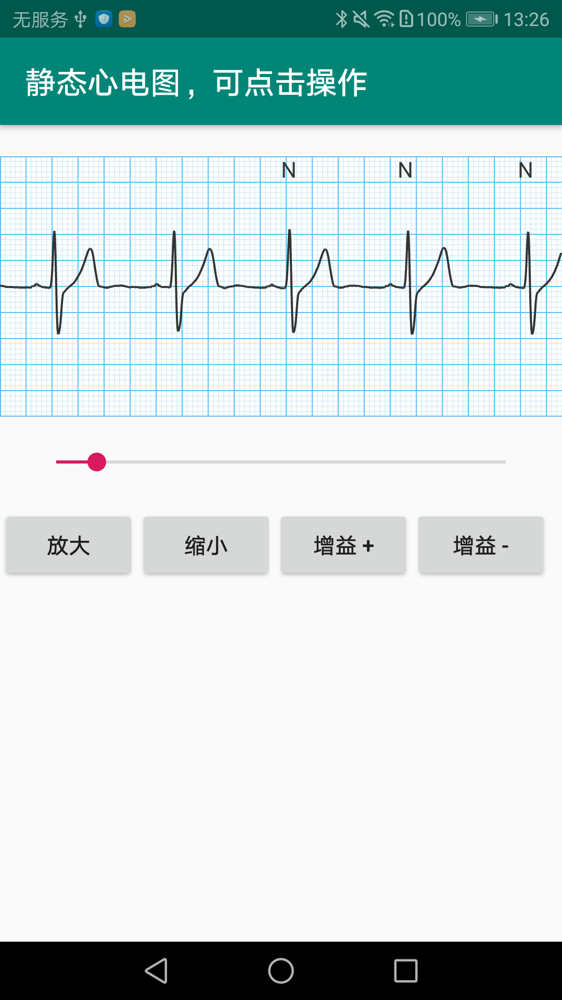
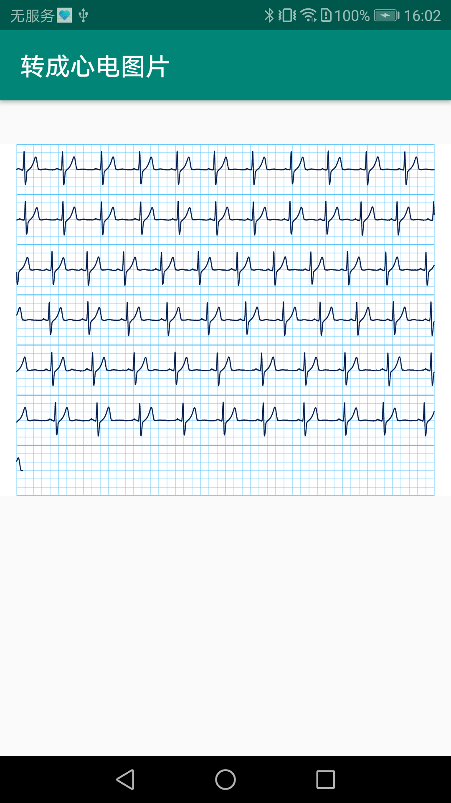

# LuckyEcgDemo
心电图表，包含洛伦兹散点图、心电图（实时、静止）、心电图片
## Preview
<p>




</p>

## 使用方式
### step1.在xml布局文件中添加ECGChartView
```
    <com.seeker.luckychart.charts.ECGChartView
        android:id="@+id/ecgChart"
        android:layout_width="match_parent"
        android:layout_height="wrap_content"
        android:layout_marginTop="20dp"
        android:layout_gravity="center_horizontal"
        app:renderMode="RENDER_CONTINUOUS"
        app:yOuterCellCounts="10"/>
```
### step2.在activity或者Fragment中添加如下代码

    1、实时模式下添加如下代码：

```
        ecgChartView = findViewById(R.id.ecgChart);
        ecgChartView.initDefaultChartData(true,true);
        ecgChartView.setFrameRenderCallback(new AbstractChartView.FrameRenderCallback() {
            @Override
            public void onPrepareNextFrame(long duration) {
               //todo 添加更新新的数据源
            }
        });
```
    2、静态模式下添加如下代码：   
```
        (1)设置静态模式
        
        ecgChartView = findViewById(R.id.ecgChart);
        ecgChartView.setFrameRate(0);
        ecgChartView.setTouchable(true);
        ecgChartView.setRenderMode(ISurface.RENDERMODE_WHEN_DIRTY);

        (2)设置数据源
        
        ECGPointContainer container = ECGPointContainer.create(values);
        container.setDrawRpeak(true);
        container.setDrawNoise(true);
        ECGChartData chartData = ECGChartData.create(container);
        ecgChartView.setChartData(chartData);
        ecgChartView.applyRenderUpdate();
```

### step3.在onResume() 与onPause()里面分别添加如下代码
```
ecgChartView.onResume();
ecgChartView.onPause();
```

## 其它函数说明
|函数|说明|
|----|----|
|updatePointsToRender(ECGPointValue... values)|添加新的数据到数据源,通常情况下用于实时模式来更新数据源|
|setDrawRPeak(boolean draw)|是否绘制标注心搏R峰|
|setDrawNoise(boolean draw)|是否绘制噪音，区别正常的数据|
|setMode(@UIMode int mode)|设置图形展示模式，平移还是刷新|
|reset()|数据源重置|
|scaleUp()|放大|
|scaleDown()|缩小|
|gainUp()|增益 +|
|gainDown()|增益 -|
|setProgress(@FloatRange(from = 0f,to = 1f) float progress)|设置当前屏幕展示的数据，通常用于静态模式下|
|setOnVisibleCoorPortChangedListener(OnVisibleCoorPortChangedListener visibleCoorPortChangedListener)|静态模式下,当前数据显示的范围回调|
